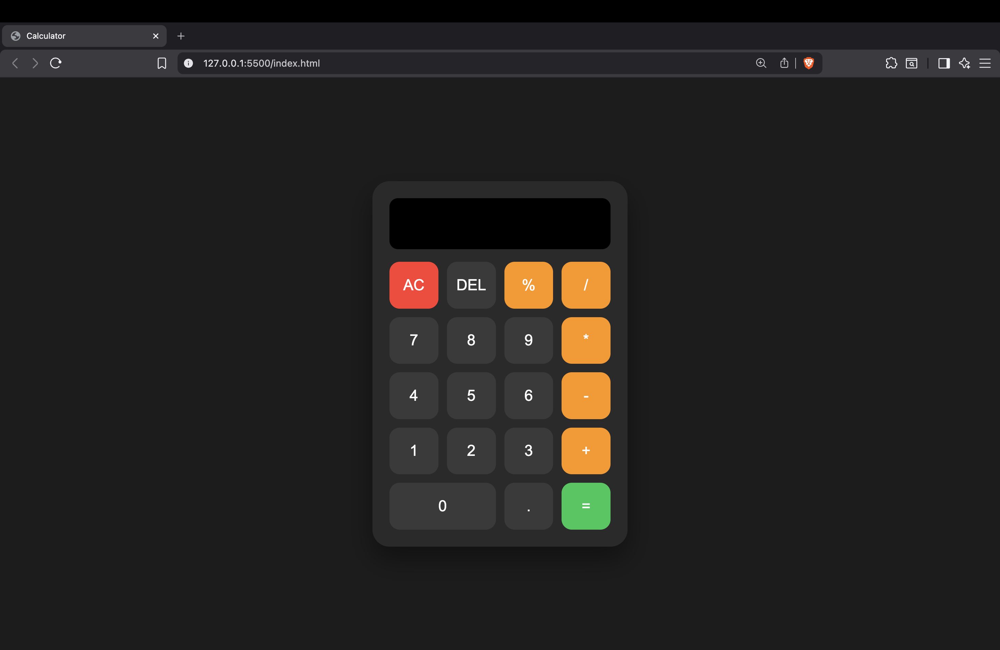

 # 🧮 Calculator Web App

A simple and responsive calculator built using **HTML, CSS, and JavaScript**.  
It performs basic arithmetic operations with an interactive and clean user interface.

---

## 🚀 Features

- Basic arithmetic operations (+, -, *, /, %)
- Clear (AC) button to reset the screen
- Delete (DEL) button to remove the last character
- Responsive grid layout for buttons
- Clean and modern UI design
- Error handling for invalid calculations

---

## 🛠️ Technologies Used

- HTML5
- CSS3 (Flexbox & Grid)
- JavaScript (DOM Manipulation)

---

## ⚙️ How It Works

- Button clicks are captured using **JavaScript event listeners**.
- The calculator screen updates dynamically when buttons are pressed.
- The `eval()` function is used to evaluate mathematical expressions.
- Error handling is implemented using `try...catch` to prevent crashes.

---

## 📸 Screenshot

